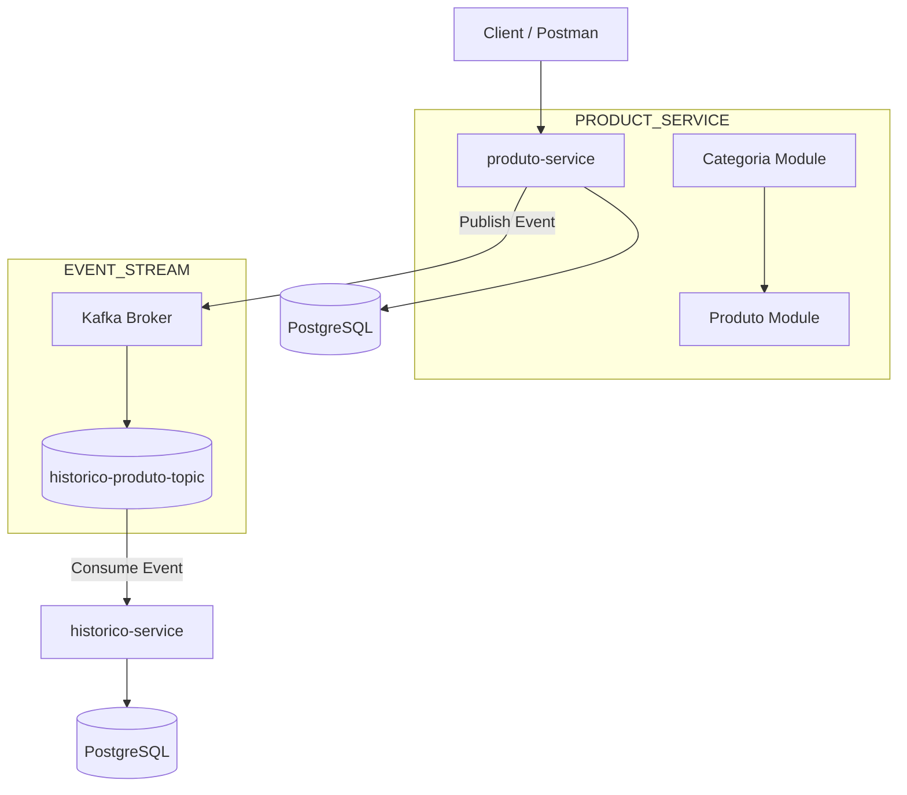

# 🚀 Inventory Microservices System (Event-Driven Architecture + Kafka)

<p align="center">
  
</p>

<p align="center">


</p>

---

# 📌 About The Project

This project is a backend platform built using:

- Microservices Architecture
- Event-Driven Architecture
- Apache Kafka
- Dockerized Infrastructure
- CI/CD Automation
- Performance Testing

The system simulates an inventory platform where products and categories are managed while all relevant operations are asynchronously processed and persisted through Kafka event streaming.

The communication model combines:

- REST APIs (synchronous communication)
- Kafka Events (asynchronous communication)

---

# 🧠 Architecture Overview



---

# ⚡ Event-Driven Flow (Kafka)

## 📤 Product Events

Whenever a product is:

- Created
- Updated
- Deleted
- Modified in stock quantity

The `produto-service` publishes an event to Kafka.

```txt
produto-service
   ↓
ProdutoEventoDTO
   ↓
Kafka Producer
   ↓
historico-produto-topic
```

---

## 📥 Consumption Flow

```txt
Kafka Topic
   ↓
historico-service
   ↓
HistoricoConsumer
   ↓
PostgreSQL Persistence
```

---

# 📦 Microservices

## 📦 produto-service

Responsible for product and category management.

### Features

- Product CRUD
- Category CRUD
- Product-category relationship
- Business rules validation
- Inventory validation
- JWT authentication
- Kafka Producer
- Unit and integration tests

---

## 🕘 historico-service

Responsible for audit and event history persistence.

### Features

- Kafka Consumer
- Event persistence
- Product history tracking
- Full audit process
- PostgreSQL integration
- JWT security

---

# 🏷️ Category Module

### Features

- Create category
- Update category
- List categories
- Disable category
- Find by ID

### Status

```java
ATIVA
INATIVA
```

---

# 📦 Product Module

### Example

```java
public class Produto {
    private Long id;
    private String nome;
    private Double preco;
    private Integer quantidade;
    private Categoria categoria;
}
```

---

# 🔗 Communication Model

## REST APIs

Used for synchronous communication.

```txt
client → produto-service → database
```

---

## Kafka Messaging

Main asynchronous communication model.

```txt
produto-service → Kafka → historico-service
```

---

# 🧾 Event Model

## ProdutoEventoDTO

```java
private Long produtoId;
private String nome;
private Double preco;
private Integer quantidadeAnterior;
private Integer quantidadeNova;
private TipoEvento tipoEvento;
```

---

## TipoEvento

```java
CRIADO
ATUALIZADO
DELETADO
```

---

# 🗄️ Database

## PostgreSQL

- produto-service → products and categories
- historico-service → audit history and events

---

# 🔐 Security

- Spring Security
- JWT Stateless Authentication
- Custom Authentication Filter
- Protected Endpoints

---

# 🧩 Business Rules

## Produto

- Prevents inventory inconsistency
- Product must always belong to a category
- Kafka events are always published

## Categoria

- Unique category name
- Only active categories can be used

## Histórico

- Duplicate events are ignored
- Full audit consistency guaranteed

---

# ⚙️ CI/CD Pipeline

This project includes a complete CI/CD pipeline using GitHub Actions.

## Pipeline Features

- Automated build process
- Docker Compose environment startup
- PostgreSQL + Kafka integration
- Automated k6 performance tests
- Integration tests execution
- Container logs collection on failure

---

# 📊 Performance Testing

The project uses k6 for load and stress testing.

## Implemented Tests

- Authentication Load Test
- Product Creation Load Test
- Product Retrieval Stress Test

## Example

```bash
k6 run infra/k6/produto-post-test.js
```

---

# 📡 API Endpoints

```txt
/auth
/produtos
/categorias
/historicos
```

---

# 🧠 Tech Stack

| Technology      | Purpose              |
| --------------- | -------------------- |
| Java 21         | Programming Language |
| Spring Boot 3   | Backend Framework    |
| Spring Security | Security             |
| JWT             | Authentication       |
| Spring Data JPA | ORM                  |
| PostgreSQL      | Relational Database  |
| Kafka           | Event Streaming      |
| Docker          | Containerization     |
| GitHub Actions  | CI/CD Pipeline       |
| k6              | Performance Testing  |
| Maven           | Build Tool           |

---

# 🐳 Docker Architecture

```txt
produto-service
historico-service
postgres
kafka
zookeeper
```

---

# 📁 Project Structure

```txt
project-root/
│
├── .github/
│   └── workflows/
│       └── ci.yml
│
├── infra/
│   ├── docker-compose.yml
│   └── k6/
│       ├── login-test.js
│       ├── produto-post-test.js
│       └── produto-get-test.js
│
├── produto-service/
└── historico-service/
```

---

# ▶️ How to Run

## Start Containers

```bash
docker compose -f infra/docker-compose.yml up --build
```

---

## Run k6 Tests

```bash
k6 run infra/k6/login-test.js
```

```bash
k6 run infra/k6/produto-post-test.js
```

```bash
k6 run infra/k6/produto-get-test.js
```

---

# 📡 Kafka Topic

```txt
historico-produto-topic
```

---

# 📈 Highlights

✔ Microservices architecture
✔ Event-driven communication
✔ Kafka integration
✔ JWT security
✔ PostgreSQL persistence
✔ Dockerized environment
✔ CI/CD with GitHub Actions
✔ k6 performance testing
✔ Docker Compose orchestration
✔ Integration testing automation
✔ Clean Architecture principles
✔ SOLID principles applied
✔ Unit and integration tests

---

# 🚀 Future Improvements

- API Gateway (Spring Cloud Gateway)
- Eureka Service Discovery
- Kafka DLQ (Dead Letter Queue)
- Redis Cache
- Prometheus + Grafana Observability
- Centralized Logging
- Kubernetes Deployment
- Distributed Tracing
- Testcontainers Integration
- SonarQube Quality Analysis

---

# 👨‍💻 Author

**Silvio Rodrigues Vieira Filho**

Backend Developer focused on:

- Java
- Spring Boot
- Microservices
- Kafka
- Event-Driven Systems
- Distributed Architectures
- Cloud Native Systems
- CI/CD Pipelines
- Performance Testing

---
