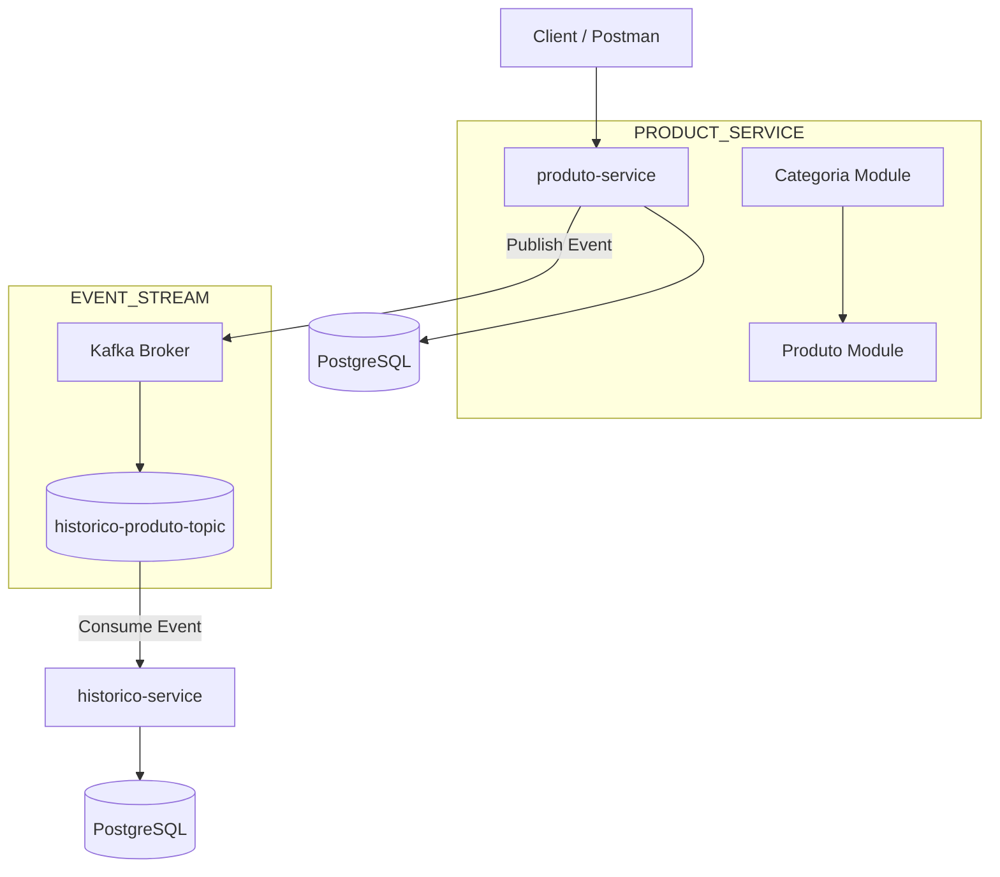

# 🚀 Inventory Microservices System (Event-Driven Architecture + Kafka)

<p align="center">
  
</p>

<p align="center">


</p>

---

# 📌 About The Project

Este projeto é um sistema backend baseado em **Microservices + Event-Driven Architecture**, utilizando **Kafka** para comunicação assíncrona entre serviços.

O sistema simula uma plataforma de inventário onde produtos e categorias são gerenciados e todas as ações relevantes são registradas em um serviço de histórico.

A comunicação acontece via:

- REST APIs (sincrono)
- Kafka Events (assincrono)

---

# 🧠 Architecture Overview



---

# ⚡ Event-Driven Flow (Kafka)

## 📤 Product Events

Quando um produto é:

- Criado
- Atualizado
- Deletado
- Alterado em estoque

O `produto-service` publica um evento no Kafka.

```txt
produto-service
   ↓
ProdutoEventoDTO
   ↓
Kafka Producer
   ↓
historico-produto-topic
```

---

## 📥 Consumption Flow

```txt
Kafka Topic
   ↓
historico-service
   ↓
HistoricoConsumer
   ↓
Persistência no PostgreSQL
```

---

# 📦 Microservices

## 📦 produto-service

Responsável pelo gerenciamento de produtos e categorias.

### Features

- CRUD de produtos
- CRUD de categorias
- Associação produto/categoria
- Regras de negócio
- Validação de estoque
- Segurança com JWT
- Kafka Producer
- Testes unitários e integração

---

## 🕘 historico-service

Responsável pelo histórico/auditoria do sistema.

### Features

- Kafka Consumer
- Persistência de eventos
- Histórico de produtos
- Auditoria completa
- PostgreSQL
- Proteção com Spring Security + JWT

---

# 🏷️ Category Module

### Funcionalidades

- Criar categoria
- Atualizar categoria
- Listar categorias
- Desativar categoria
- Buscar por ID

### Status

```java
ATIVA
INATIVA
```

---

# 📦 Product Module

### Exemplo

```java
public class Produto {
    private Long id;
    private String nome;
    private Double preco;
    private Integer quantidade;
    private Categoria categoria;
}
```

---

# 🔗 Communication Model

## REST (interno)

Atualmente usado apenas para operações síncronas dentro dos serviços.

```txt
cliente → produto-service → banco
```

---

## Kafka (principal)

```txt
produto-service → Kafka → historico-service
```

---

# 🧾 Event Model

## ProdutoEventoDTO

```java
private Long produtoId;
private String nome;
private Double preco;
private Integer quantidadeAnterior;
private Integer quantidadeNova;
private TipoEvento tipoEvento;
```

---

## TipoEvento

```java
CRIADO
ATUALIZADO
DELETADO
```

---

# 🗄️ Database

### PostgreSQL

- produto-service → produtos e categorias
- historico-service → eventos de auditoria

---

# 🔐 Security

- Spring Security
- JWT (stateless authentication)
- Filtro de autenticação customizado
- Proteção de endpoints

---

# 🧩 Business Rules

## Produto

- Não permite inconsistência de estoque
- Sempre vinculado a categoria
- Eventos são publicados no Kafka

## Categoria

- Nome único
- Categoria deve estar ativa para uso

## Histórico

- Eventos duplicados são ignorados
- Auditoria completa garantida

---

# 📡 API Endpoints

```txt
/auth
/produtos
/categorias
/historicos
```

---

# 🧠 Tech Stack

| Tecnologia      | Uso            |
| --------------- | -------------- |
| Java 21         | Linguagem      |
| Spring Boot 3   | Framework      |
| Spring Security | Segurança      |
| JWT             | Autenticação   |
| Spring Data JPA | ORM            |
| PostgreSQL      | Banco de dados |
| Kafka           | Mensageria     |
| Docker          | Containers     |
| Maven           | Build          |

---

# 🐳 Docker Architecture

```txt
produto-service
historico-service
postgres
kafka
zookeeper
```

---

# ▶️ How to Run

```bash
docker compose up --build
```

---

# 📡 Kafka Topic

```txt
historico-produto-topic
```

---

# 📈 Highlights

✔ Microservices architecture
✔ Event-driven communication
✔ Kafka integration
✔ JWT security
✔ PostgreSQL persistence
✔ Clean architecture principles
✔ SOLID applied
✔ Test coverage (unit + integration)
✔ Dockerized environment

---

# 🚀 Future Improvements

- API Gateway (Spring Cloud Gateway)
- Eureka Service Discovery
- Kafka DLQ (Dead Letter Queue)
- Redis Cache
- Observability (Prometheus + Grafana)
- Centralized Logging
- CI/CD Pipeline
- Kubernetes deployment

---

# 👨‍💻 Author

**Silvio Rodrigues Vieira Filho**

Backend Developer focused on:

- Java
- Spring Boot
- Microservices
- Kafka
- Event-Driven Systems
- Distributed Architectures
- Cloud Native Systems
