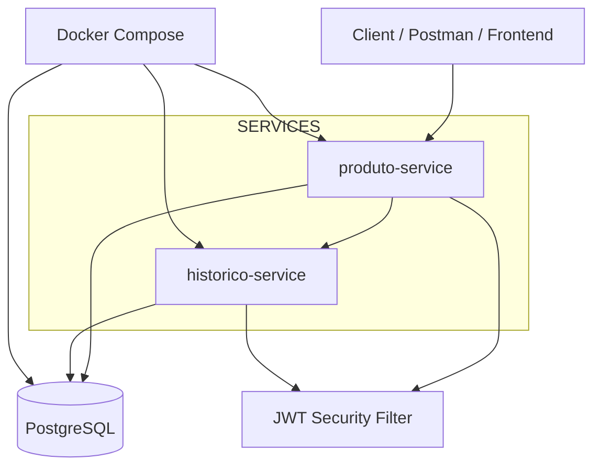

# 🚀 Inventory Microservices System

<p align="center">
  
</p>

<p align="center">


</p>

---

# 📌 About The Project

Enterprise backend application based on **Microservices Architecture** using:

- Java 21
- Spring Boot 3
- Spring Security + JWT
- OpenFeign
- Spring Data JPA
- PostgreSQL
- Docker & Docker Compose
- Automated Testing

The project simulates a real-world backend ecosystem focused on:

✔ Scalable architecture  
✔ Service isolation  
✔ REST communication  
✔ Authentication & Authorization  
✔ Business rules validation  
✔ Event tracking  
✔ Clean Code  
✔ SOLID principles  
✔ Enterprise backend patterns  
✔ Containerized infrastructure

---

# 🗄️ Database & Infrastructure

This project was upgraded from H2 to **PostgreSQL** and fully containerized with Docker.

## PostgreSQL

- Persistent relational database
- Shared between microservices
- Production-ready configuration

## Docker

Full orchestration using Docker Compose:

- postgres-db
- produto-service
- historico-service

---

# 🏗️ Architecture Overview



---

# 🧩 Microservices

## 📦 produto-service

Responsável por gerenciamento de produtos e regras de negócio.

### Features

- CRUD de produtos
- Controle de estoque
- Merge de produtos duplicados
- Filtros dinâmicos
- Integração com histórico via OpenFeign
- Segurança JWT
- Autorização por role

---

## 🕘 historico-service

Responsável por auditoria e eventos.

### Features

- Registro de eventos de produtos
- Auditoria de estoque
- Persistência de histórico
- Consumo de eventos via REST
- Segurança JWT

---

# 🔗 Comunicação entre serviços

- REST APIs
- OpenFeign

Fluxo:

```txt
produto-service → historico-service
```

---

# 🔐 Security Layer

- Spring Security
- JWT Authentication
- Stateless session
- Authorization filters
- Role-based access

---

# 🧠 Business Rules

## Produtos

- Produtos duplicados são automaticamente mesclados
- Atualizações geram eventos no histórico
- Controle de estoque validado

## Usuários

- Usuários bloqueados não autenticam
- Token JWT obrigatório
- Acesso baseado em roles

---

# 🛠️ Technologies

| Tech            | Purpose                    |
| --------------- | -------------------------- |
| Java 21         | Language                   |
| Spring Boot 3   | Framework                  |
| Spring Security | Security                   |
| JWT             | Authentication             |
| OpenFeign       | Microservice communication |
| Spring Data JPA | Persistence                |
| Hibernate       | ORM                        |
| PostgreSQL      | Database                   |
| Docker          | Containerization           |
| Docker Compose  | Orchestration              |
| MapStruct       | DTO mapping                |
| JUnit 5         | Testing                    |
| Mockito         | Mocking                    |

---

# 📂 Project Structure

```txt
inventory-microservices/
│
├── produto-service/
├── historico-service/
├── docker-compose.yml
├── docs/
│   ├── Arquitetura/
│   ├── Postman/
│   └── imagens/
└── README.md
```

---

# 🧪 Tests

- Unit tests
- Service tests
- Repository tests
- Security tests (JWT)
- Mockito mocks
- Business rules tests

---

# ▶️ Running The Project

## 🐳 Docker (Recommended)

```bash
docker compose up --build
```

## 🧱 Manual run

```bash
cd produto-service
./mvnw spring-boot:run
```

```bash
cd historico-service
./mvnw spring-boot:run
```

---

# 🔑 Authentication

```http
POST /auth/login
```

```json
{
  "message": "Login realizado com sucesso",
  "data": {
    "token": "JWT_TOKEN",
    "email": "user@email.com",
    "role": "USER"
  }
}
```

---

# 📬 Postman Collection

Local:

```txt
docs/Postman/
```

---

# 📈 Highlights

✔ Microservices Architecture
✔ Docker + PostgreSQL
✔ JWT Security
✔ OpenFeign Communication
✔ Clean Architecture
✔ SOLID Principles
✔ Event-driven tracking
✔ Production-ready structure

---

# 👨‍💻 Author

**Silvio Rodrigues Vieira Filho**

Backend Developer focused on:

- Java
- Spring Boot
- Microservices
- Security
- Distributed Systems

---

# ⭐ Future Improvements

- API Gateway
- Service Discovery (Eureka)
- Kafka Event Streaming
- CI/CD Pipeline
- Kubernetes Deployment
- Observability (Prometheus + Grafana)

```

---
```
