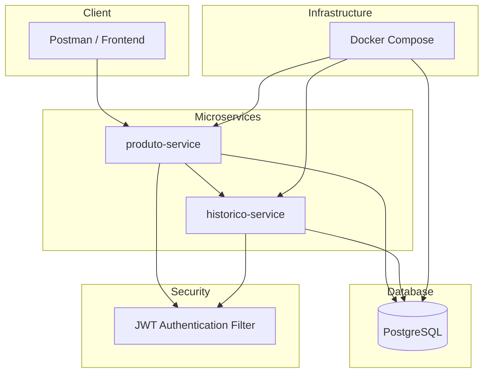

# 🚀 Inventory Microservices System

<p align="center">
  
</p>

<p align="center">


</p>

---

# 📌 About The Project

Enterprise backend application based on **Microservices Architecture** using:

- Java 21
- Spring Boot 3
- Spring Security + JWT
- OpenFeign
- Spring Data JPA
- PostgreSQL
- Docker & Docker Compose
- Automated Testing

The project simulates a real-world backend ecosystem focused on:

✔ Scalable architecture  
✔ Service isolation  
✔ REST communication  
✔ Authentication & Authorization  
✔ Business rules validation  
✔ Event tracking  
✔ Clean Code  
✔ SOLID principles  
✔ Enterprise backend patterns  
✔ Containerized infrastructure

---

# 🗄️ Database & Infrastructure

The project was upgraded from in-memory database (H2) to **PostgreSQL** with full Docker support.

## PostgreSQL

- Persistent relational database
- Shared between microservices
- Production-ready configuration

## Docker

The system is fully containerized using Docker Compose.

### Services

- postgres-db
- produto-service
- historico-service

---

# 🏗️ Architecture Overview



````

---

# 🧩 Microservices

# 📦 produto-service

Responsible for inventory management and business rules.

## Features

- Product CRUD
- Inventory control
- Product merge logic
- Dynamic filters
- JWT Authentication
- Role-based Authorization
- Event publishing via OpenFeign
- REST API integration

---

# 🕘 historico-service

Responsible for audit logs and event persistence.

## Features

- Product event history
- Audit logging
- Inventory tracking
- Event persistence
- JWT protected routes
- REST event consumption

---

# 🔗 Communication Between Services

- REST APIs
- OpenFeign Client

Flow:

```txt
produto-service → historico-service
```

---

# 🔐 Security Layer

- Spring Security
- JWT Authentication
- Stateless sessions
- Authorization filters
- Role-based access control
- Protected endpoints

---

# 🧠 Business Rules

## Product Rules

- Duplicate products are merged automatically
- SOLD_OUT products cannot receive stock
- All updates generate history events
- Inventory operations are audited

## User Rules

- BLOCKED users cannot authenticate
- DISABLED users are denied access
- JWT required for all protected routes

---

# 🛠️ Technologies

| Technology      | Purpose                        |
| --------------- | ------------------------------ |
| Java 21         | Main language                  |
| Spring Boot 3   | Backend framework              |
| Spring Security | Authentication & Authorization |
| JWT             | Stateless authentication       |
| OpenFeign       | Microservice communication     |
| Spring Data JPA | Persistence                    |
| Hibernate       | ORM                            |
| PostgreSQL      | Database                       |
| Docker          | Containerization               |
| Docker Compose  | Multi-service orchestration    |
| MapStruct       | DTO mapping                    |
| JUnit 5         | Testing                        |
| Mockito         | Mocking                        |

---

# 📂 Project Structure

```txt
inventory-microservices/
│
├── produto-service/
├── historico-service/
├── docs/
│   ├── Arquitetura/
│   ├── Postman/
│   └── imagens/
└── docker-compose.yml
```

---

# 🧪 Tests

- Unit Tests
- Service Layer Tests
- Repository Tests
- Security Tests (JWT)
- Mockito mocks
- Business rule validation tests

---

# ▶️ Running The Project

## 🐳 Docker (Recommended)

```bash
docker compose up --build
```

This will start:

- PostgreSQL
- produto-service (8080)
- historico-service (8081)

---

## 🧱 Manual Run

```bash
cd produto-service
./mvnw spring-boot:run
```

```bash
cd historico-service
./mvnw spring-boot:run
```

---

# 🔑 Authentication

## Login

```http
POST /auth/login
```

## Response

```json
{
  "message": "Login realizado com sucesso",
  "data": {
    "token": "JWT_TOKEN",
    "email": "user@email.com",
    "role": "USER"
  }
}
```

---

# 📬 Postman Collection

Located at:

```txt
docs/Postman/
```

Includes:

- Auth requests
- Product CRUD
- JWT tests
- Integration flows

---

# 📈 Technical Highlights

✔ Microservices Architecture
✔ JWT Security
✔ OpenFeign Communication
✔ PostgreSQL Integration
✔ Dockerized System
✔ Clean Architecture
✔ SOLID Principles
✔ Event Tracking System
✔ DTO Pattern
✔ Enterprise Backend Design

---

# 👨‍💻 Author

## Silvio Rodrigues Vieira Filho

Backend Developer focused on:

- Java
- Spring Boot
- Microservices
- Security
- Distributed Systems

This project was created for portfolio and backend architecture studies.

---

# ⭐ Future Improvements

- API Gateway
- Service Discovery (Eureka)
- Kafka Event Streaming
- CI/CD Pipeline
- Kubernetes Deployment
- Observability (Prometheus + Grafana)
````
