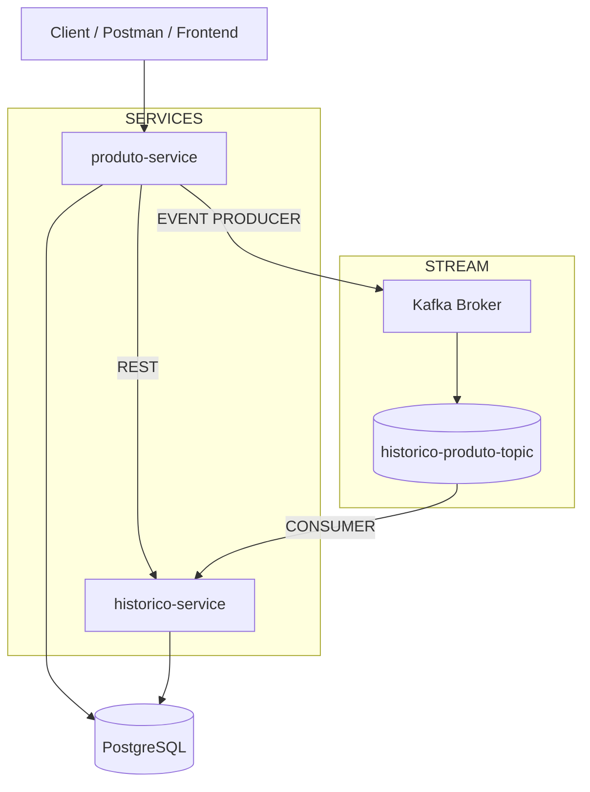

# 🚀 **Inventory Microservices System (Event-Driven + Kafka)**

<p align="center">
  
</p>

<p align="center">


</p>

---

# 📌 About The Project

Enterprise backend system based on **Microservices + Event-Driven Architecture** using:

- Java 21
- Spring Boot 3
- Kafka (Event Streaming)
- Spring Security + JWT
- OpenFeign
- PostgreSQL
- Docker & Docker Compose
- Clean Architecture & SOLID principles

The system simulates a real-world distributed backend where services communicate via:

- REST (synchronous)
- Kafka (asynchronous events)

---

# 🧠 Architecture Overview



---

# ⚡ Event-Driven Flow (Kafka)

## 📤 1. Product Creation / Update

When a product is created or updated:

```txt
produto-service
   ↓
Creates ProdutoEventoDTO
   ↓
Publishes event to Kafka topic
   ↓
historico-produto-topic
```

---

## 📥 2. Event Consumption

```txt
Kafka Topic
   ↓
historico-service (Consumer)
   ↓
HistoricoConsumer.consumir()
   ↓
Transforms DTO → Entity
   ↓
Persists in PostgreSQL
```

---

## 🧾 3. Final Result

```txt
Product Action → Event → Kafka → Historico Saved
```

---

# 📦 Microservices

## 📦 produto-service

Responsible for product lifecycle.

### Features

- CRUD operations
- Stock management
- Business validation
- Kafka event producer
- OpenFeign integration
- JWT security

### Kafka Producer

```txt
Publishes:
ProdutoEventoDTO
→ historico-produto-topic
```

---

## 🕘 historico-service

Responsible for event tracking and audit.

### Features

- Kafka consumer
- Event persistence
- Product history tracking
- Audit logs
- PostgreSQL storage

### Kafka Consumer

```java
@KafkaListener(topics = "historico-produto-topic")
public void consumir(ProdutoEventoDTO dto)
```

---

# 🔗 Communication Model

## Synchronous (REST)

```txt
produto-service → historico-service
(OpenFeign)
```

## Asynchronous (Kafka)

```txt
produto-service → Kafka → historico-service
```

---

# 🧾 Event Model

## ProdutoEventoDTO

```java
private Long produtoId;
private String nome;
private Double preco;
private Integer quantidadeAnterior;
private Integer quantidadeNova;
private TipoEvento tipoEvento;
```

---

## TipoEvento

```java
CRIADO
ATUALIZADO
DELETADO
```

---

# 🗄️ Database

- PostgreSQL (shared or separated per service)
- Event persistence in `historico-service`

---

# 🔐 Security

- JWT Authentication
- Stateless architecture
- Role-based access control
- Secure REST endpoints

---

# 🧩 Business Rules

## Produto Service

- Duplicate products are merged
- Stock updates generate Kafka events
- Business validation enforced

## Historico Service

- Only persists valid events
- Ignores corrupted messages
- Stores full audit trail

---

# 🧠 Technologies

| Tech          | Role                  |
| ------------- | --------------------- |
| Java 21       | Core language         |
| Spring Boot 3 | Framework             |
| Kafka         | Event streaming       |
| PostgreSQL    | Database              |
| Docker        | Containerization      |
| JWT           | Security              |
| OpenFeign     | Service communication |
| JPA/Hibernate | ORM                   |

---

# 🐳 Docker Architecture

```txt
services:
  - produto-service
  - historico-service
  - kafka
  - zookeeper
  - postgres
```

---

# ▶️ Running the System

## Docker

```bash
docker compose up --build
```

---

# 📡 Kafka Topic

```txt
historico-produto-topic
```

---

# 📈 Highlights

✔ Microservices architecture
✔ Event-driven system (Kafka)
✔ REST + Async hybrid communication
✔ Audit trail system
✔ Scalable architecture
✔ Production-style backend design

---

# 🚀 Future Improvements

- API Gateway (Spring Cloud Gateway)
- Eureka Service Discovery
- Schema Registry (Kafka Avro)
- Dead Letter Queue (DLQ)
- Observability (Prometheus + Grafana)
- Kubernetes deployment
- CI/CD pipeline

---

# 👨‍💻 Author

**Silvio Rodrigues Vieira Filho**

Backend Developer focused on:

- Java
- Spring Boot
- Microservices
- Event-driven systems
- Distributed architecture
