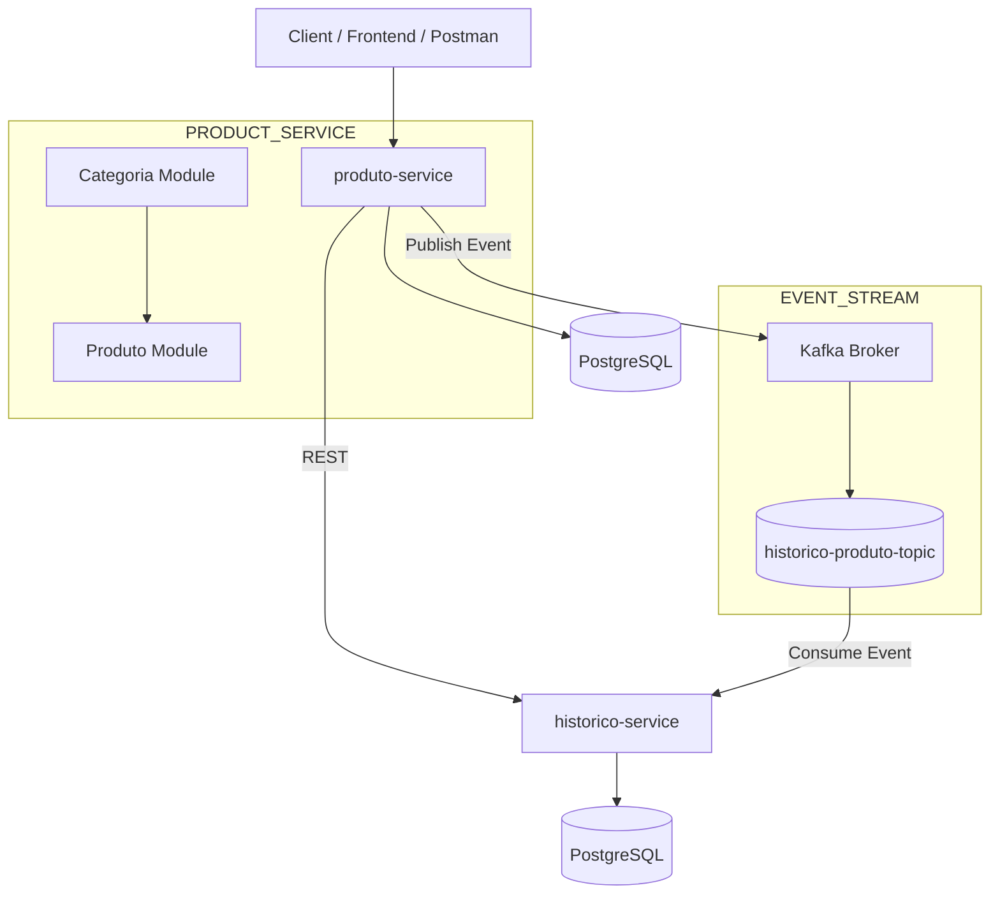

# 🚀 Inventory Microservices System (Event-Driven + Kafka)

<p align="center">
  
</p>

<p align="center">


</p>

---

# 📌 About The Project

Enterprise backend system based on **Microservices + Event-Driven Architecture** using:

- Java 21
- Spring Boot 3
- Apache Kafka
- Spring Security + JWT
- OpenFeign
- PostgreSQL
- Docker & Docker Compose
- Clean Architecture
- SOLID Principles

The system simulates a real-world inventory management platform where products are organized into categories and all important operations are tracked through asynchronous events.

Communication happens through:

- REST APIs (synchronous)
- Kafka Events (asynchronous)

---

# 🧠 Architecture Overview



---

# ⚡ Event-Driven Flow (Kafka)

## 📤 Product Operations

Whenever a product is:

- Created
- Updated
- Deleted
- Stock Updated

The product service publishes an event.

```txt
produto-service
    ↓
ProdutoEventoDTO
    ↓
Kafka Producer
    ↓
historico-produto-topic
```

---

## 📥 Event Consumption

```txt
Kafka Topic
    ↓
historico-service
    ↓
HistoricoConsumer
    ↓
Entity Mapping
    ↓
PostgreSQL
```

---

## 🧾 Final Result

```txt
Product Action
      ↓
Kafka Event
      ↓
History Service
      ↓
Audit Record Saved
```

---

# 📦 Microservices

## 📦 produto-service

Responsible for inventory management.

### Features

- Product CRUD
- Category CRUD
- Product/category association
- Business validations
- Stock management
- JWT Authentication
- OpenFeign Integration
- Kafka Producer

---

## 🕘 historico-service

Responsible for audit and tracking.

### Features

- Kafka Consumer
- Event Persistence
- Audit Logs
- Product History Tracking
- PostgreSQL Storage

---

# 🏷️ Category Module

The category module allows inventory organization.

### Features

- Create category
- Update category
- Delete category
- List categories
- Search by ID
- Enable/Disable categories
- Associate products with categories

### Category Status

```java
ATIVA
INATIVA
```

### Example Category

```java
public class Categoria {

    private Long id;
    private String nome;
    private StatusCategoria status;

}
```

---

# 📦 Product Module

Products belong to a category.

### Example Product

```java
public class Produto {

    private Long id;
    private String nome;
    private Double preco;
    private Integer quantidade;

    private Categoria categoria;

}
```

---

# 🔗 Communication Model

## REST Communication

```txt
produto-service
       ↓
OpenFeign
       ↓
historico-service
```

---

## Kafka Communication

```txt
produto-service
       ↓
Kafka Producer
       ↓
historico-produto-topic
       ↓
historico-service
```

---

# 🧾 Event Model

## ProdutoEventoDTO

```java
private Long produtoId;
private String nome;
private Double preco;
private Integer quantidadeAnterior;
private Integer quantidadeNova;
private TipoEvento tipoEvento;
```

---

## TipoEvento

```java
CRIADO
ATUALIZADO
DELETADO
```

---

# 🗄️ Database

PostgreSQL is used for persistence.

### produto-service

Stores:

- Products
- Categories

### historico-service

Stores:

- Product History
- Audit Events

---

# 🔐 Security

Authentication and authorization are implemented using:

- Spring Security
- JWT
- Stateless Sessions
- Endpoint Protection

---

# 🧩 Business Rules

## Categoria

- Category names must be unique.
- Inactive categories cannot receive new products.
- Category status is validated before product association.

## Produto

- Duplicate products are merged.
- Stock updates generate Kafka events.
- Every product belongs to a category.
- Product validations are enforced.

## Histórico

- Only valid events are persisted.
- Invalid messages are ignored.
- Full audit trail is maintained.

---

# 📡 API Domains

```txt
/auth
/produtos
/categorias
/historicos
```

---

# 🧠 Technologies

| Technology | Purpose |
|------------|----------|
| Java 21 | Programming Language |
| Spring Boot 3 | Backend Framework |
| Spring Security | Authentication |
| JWT | Authorization |
| Spring Data JPA | ORM |
| PostgreSQL | Database |
| Kafka | Event Streaming |
| OpenFeign | Service Communication |
| Docker | Containerization |
| Maven | Dependency Management |

---

# 🐳 Docker Architecture

```txt
services:
 ├── produto-service
 ├── historico-service
 ├── postgres
 ├── kafka
 └── zookeeper
```

---

# ▶️ Running The System

## Docker

```bash
docker compose up --build
```

---

# 📡 Kafka Topic

```txt
historico-produto-topic
```

---

# 📈 Highlights

✔ Microservices Architecture

✔ Event-Driven Design

✔ Apache Kafka Integration

✔ JWT Authentication

✔ Product Management

✔ Category Management

✔ Audit Trail System

✔ OpenFeign Communication

✔ Dockerized Environment

✔ Clean Architecture Principles

✔ SOLID Principles

✔ Production-Style Backend

---

# 🚀 Future Improvements

- API Gateway
- Spring Cloud Gateway
- Eureka Service Discovery
- Kafka Schema Registry
- Dead Letter Queue (DLQ)
- Redis Cache
- Prometheus
- Grafana
- Kubernetes
- CI/CD Pipeline
- Centralized Logging

---

# 👨‍💻 Author

**Silvio Rodrigues Vieira Filho**

Backend Developer focused on:

- Java
- Spring Boot
- Kafka
- Microservices
- Event-Driven Systems
- Distributed Architectures
- Cloud-Native Applications